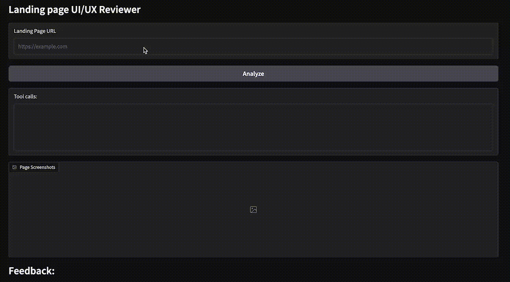

# Domain-Aware UI/UX Reviewer 
Agent to analyze a given **landing page** using desktop and mobile views and simple tools to get html structure, readability score..

Main idea was to test haystack for creating Agents. Code can be improved/better organized but the focus was more on trying out haystack's 'Agent'. Flow is simple- we input a url, use playwright to capture desktop and mobile views, pass data and some simple tools to the agent and receive a feedback based on
* Content(how suitable and effective the content is for the given domain)
* Layout(layout quality, CTAs and ease of navigation)
* Visuals

# How to run
* Create and activate a virtual environment
* Install dependencies `pip install -r requirements.txt`
* Install chromium for playwright `playwright install chromium`
* Run the app `python app.py`

# Demo

